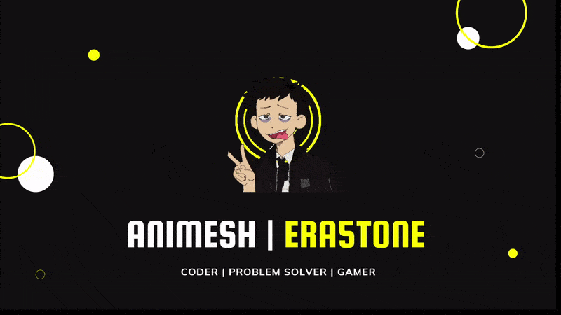

### Hi 

 
 
 

Hi, I'm [Animesh Singh](https://iamanimesh.tech/), a Software Developer from India specializing in building exceptional Web Apps. My passion for software lies with dreaming up ideas and making them come true with elegant interfaces. I take great care in the experience, architecture, and code quality of the things I build.

<!--  -->

:dash: Info 

   

**Talking about Personal Stuff:**

- 👨🏽‍💻 I’m currently looking to collaberate on open source projects or ideas
- 🌱 I write articles for [@Meusec](https://www.meusec.com/) and archive them [here](https://animeshry.github.io/blog/)
- 💬 Ask me about anything, I am happy to help
- 📫 How to reach me: [@AnimeshRy](https://twitter.com/AnimeshRy)

**Stack and Tools I prefer:**  

- MERN (Next JS)
- Django + PostgreSQL
- DRF + React + PostgreSQL

<code></code>
<code></code>
<code></code>
<code></code>
<code></code>
<code></code>
<code></code>
<code></code>
<code></code>
<code></code>
<code></code>
<code></code>
<code></code>
<code></code>
<code></code>
<code></code>

📈 My GitHub Stats

   

